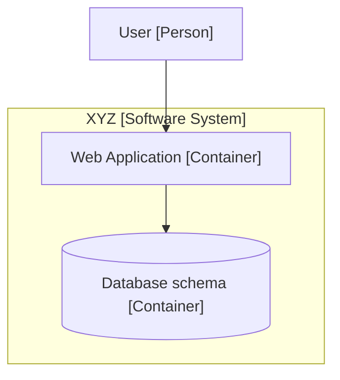
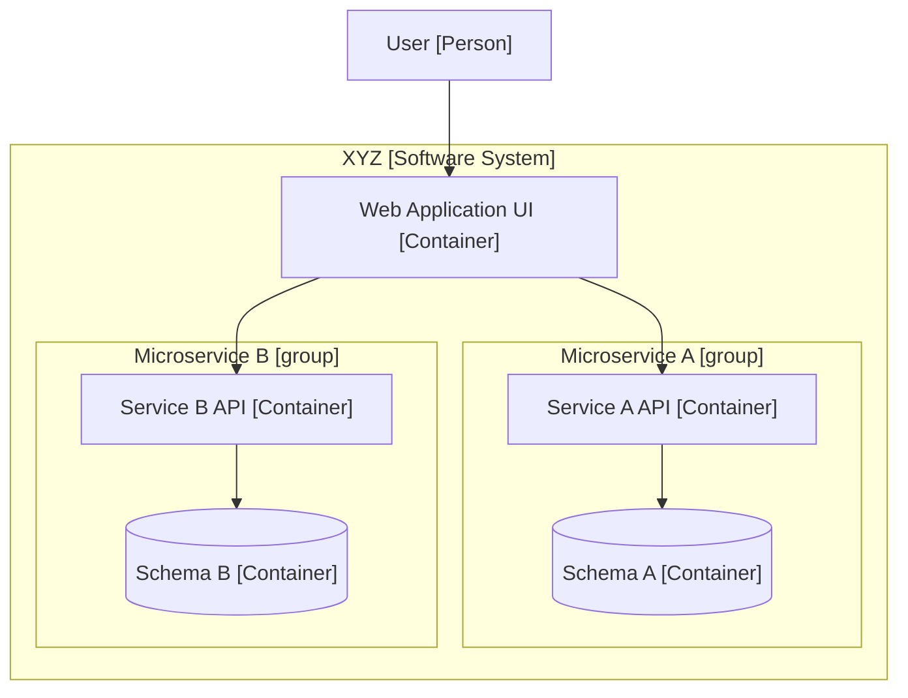
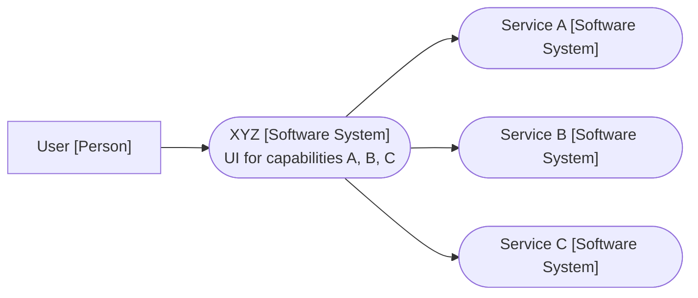
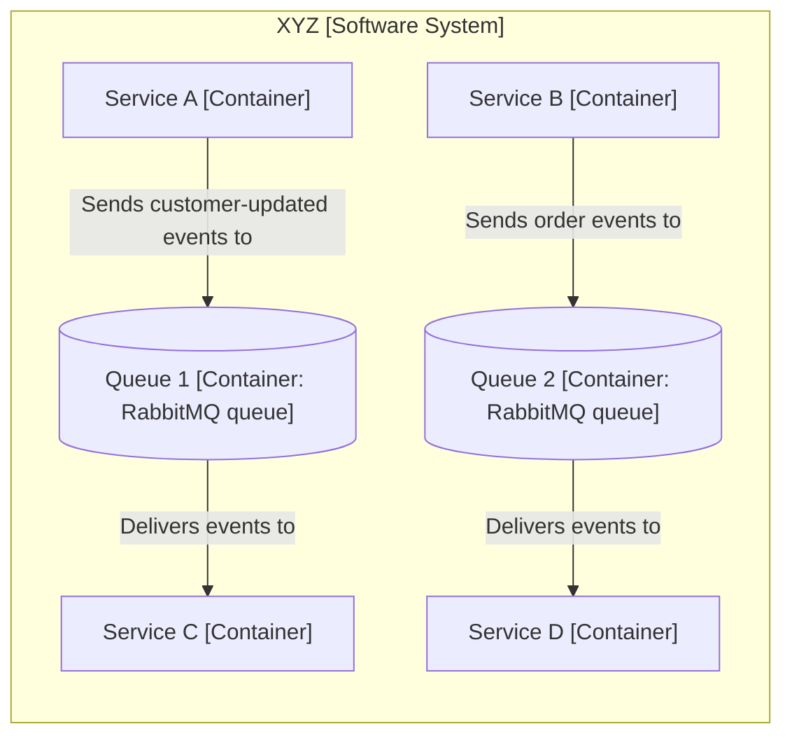
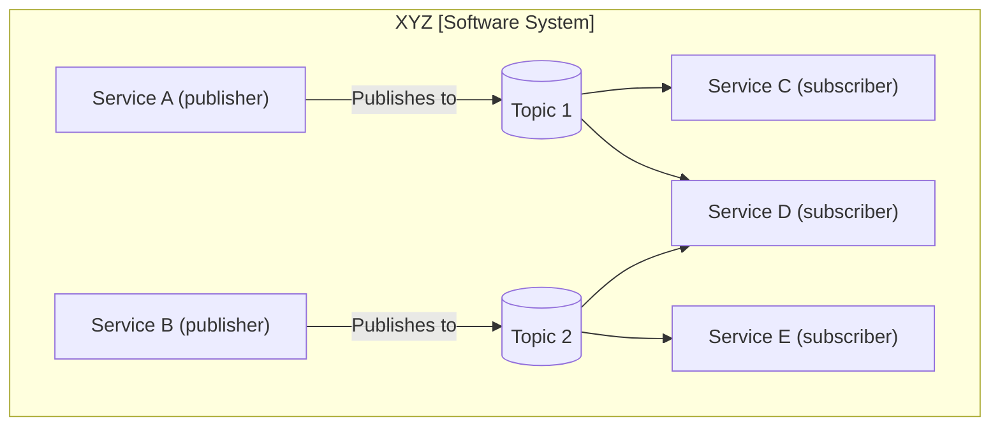
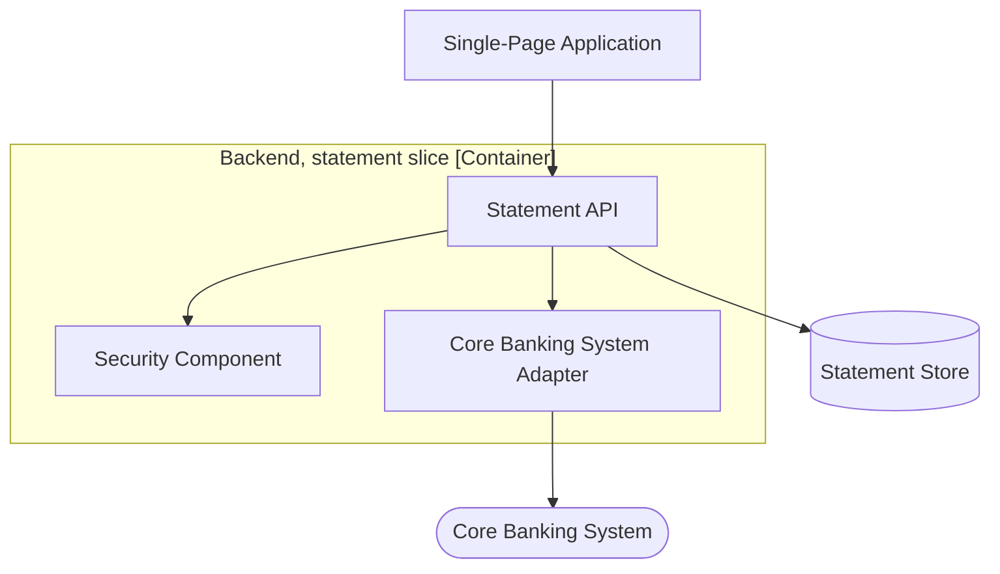

# C4 Beyond the Basics, Deep Reference

Microservices, message-driven architectures, grouping vs new abstractions, feature teams, scaling strategies, tooling, and maturity. Model-code gap and hardware systems live in `abstractions.md`.

## Abstraction versus organization

People who ask for more C4 levels usually want one of: subsystems, bounded contexts, architectural layers, libraries. Two root causes:

1. **Misuse of the existing levels** (e.g. microservice as one container with "Java and MySQL" technology; fails the one-OS-process test, so API and schema are two containers).
2. **Organizational constructs mistaken for abstractions.** Layers, modules, bounded contexts, subsystems, and departments are *groupings of* C4 elements, not new levels.

The fix is grouping boxes:

- **Architectural layers:** draw layer boxes around components on the component diagram. Do not draw the classic three-layer diagram alone: it flattens the real web of collaborators (UI components calling several domain services calling several repositories) into a fiction. Draw the web; wrap it in layer groups.
- **Build modules/libraries:** group components by JAR/DLL/module boundary.
- **Bounded contexts:** group systems, containers, or components depending on how the context maps to the org/codebase.
- **Subsystems:** group components.
- **Departments/cloud accounts:** group systems (landscape) or nodes (deployment).

You *can* define new abstraction levels, but that is an advanced maneuver: unless you precisely define them, ambiguity returns you to ad hoc boxes and arrows. Do not promote a layer or capability to a fake "software system" that slices across real services.

## Microservices: the three-stage story

The Lewis/Fowler definition says a single *application* is built as a suite of small services; substitute "software system" and the mapping follows from ownership.

**Stage 1: monolith.** Startup, one team, system XYZ offering capabilities A and B. Container diagram: one web app + one schema inside the XYZ boundary.

**Stage 2: in-team microservices.** Same team, same repo, business logic and data move into per-capability services. The system context diagram does not change (microservices are an implementation detail inside the team boundary). Each microservice = a **group of containers** (API + schema); draw a group box per service to make the pairing obvious. A stateless service can be a group of one container.

**Stage 3: team split.** Teams A/B/C now own services A/B/C in separate repos. Each service is "promoted" to a **software system**. Team XYZ's context diagram shows services A, B, C as external systems; team XYZ's container diagram shrinks to just its UI. Each service team maintains its own context + container pair (service A's context shows the inbound dependency from XYZ; its container diagram shows API + schema).

**Do not draw cross-system container diagrams.** A container diagram that opens XYZ *and* services A, B, C looks attractive but documents other teams' internals: coupling by diagram. It goes stale the moment another team restructures or rewrites, and you did not need it: the API contract is the interface. Treat other teams' systems as opaque boxes.

## Message-driven architectures

The anti-pattern: one "Message Bus" container in the middle with "Sends messages to" labels. It is technically accurate but hub-and-spoke rendering hides the real producer/consumer coupling, a bus is neither an application nor a data store, and "sends messages" says nothing.

A queue or topic **is** a data store: a bucket holding messages, producers adding, consumers taking. Model each queue/topic as its own container.

**Variant 1, explicit queues (point-to-point):**

Now the A-to-C and B-to-D couplings are visible. Label with the message type, not "messages".

**Variant 2, compact (queues on labels):** for simple point-to-point, omit the queue boxes and put queue name + tech on the arrow: `A -->|"Sends events via queue-1 [RabbitMQ]"| C`. Simpler, but queues are less evident. Neither variant is "better"; pick for the story.

**Variant 3, pub/sub emphasis:** direction and layout highlight one-to-many topics:

**Ownership across systems:** when producers and consumers are separate software systems, decide who owns the queue/topic definition, message format, and operations. Ownership decides which system boundary contains that container, or whether it is jointly owned. Say so on the diagram.

Deployment independence: logical queues map to whatever broker topology each environment uses (one local broker in dev, separate clusters in prod); that mapping lives on deployment diagrams.

## Software systems versus feature-based teams

Feature teams, squads, and stream-aligned teams cut across systems: team X delivers capability X by modifying systems A and B. Do **not** model capabilities X and Y as software systems; their "internals" are just subsets of A's and B's internals, duplicated across diagram sets. Keep one diagram set per real system (A, B) and let feature teams edit those sets as part of their work.

## Diagrams as design feedback

A diagram that turns into a tangled mess of crossing arrows (functions triggering functions via DynamoDB inserts, and so on) is telling you something about the *design*, not just the drawing. Pause and simplify the solution before reaching for layout tricks.

## Scaling the C4 model

For 70 or 700 components instead of 7, combine:

**Not shown for brevity.** Cross-cutting elements (logging, auditing) have inbound arrows from everything. Either omit the element and note it ("All components write logs via a logging component, not shown for brevity"), or keep the element unconnected and mark its users with a key-defined symbol ("* denotes use of the logging component").

**Perspectives.** Extra attributes (ownership, security detail, tech debt) as a layer over an existing view rather than another diagram or bigger boxes: an ownership perspective on the landscape ("Owner: Team B" per system), a security perspective on a deployment node ("server-side encryption, AES-256"). Tool-dependent; in plain text/Mermaid, a perspective can be a second render of the same model with the attribute shown. Resist showing everything at once; supplementary prose is sometimes the better channel.

**Split the diagram.** One big diagram is high cognitive load. Split by:

- Landscape: one per department / bounded context / product domain.
- Context: one per business capability, showing only that capability's integration points.
- Container/component: one per architectural slice (feature, use case, functional area).

Example slice (statements only):

Trade-off: you lose the single big picture. Mitigate by keeping a coarse overview plus slices.

**Alternative visualizations.** A model is a directed graph; boxes-and-arrows is one rendering. Force-directed graphs (with nearest-neighbor exploration), trees (deployment hierarchies), or graph-database queries ("what is impacted if X changes?") all work when the model is data rather than pixels.

## Tooling: diagramming versus modeling

Selection questions: who authors and how technical are they; who reads and how; drag-and-drop vs diagrams-as-code; version-control storage vs tool cloud; diffability; open vs closed format; interactive vs static; cost; hosting; and the big one, **diagramming vs modeling**.

- **Diagramming tools** (Visio-style, plain Mermaid) know only shapes: no validation ("no components on a context diagram" is unenforceable), no queries ("all dependencies of component X"), copy-paste drift between zoom levels (rename an element on one diagram, hunt it on the rest), and no automatic key generation.
- **Modeling tools** hold one nonvisual definition of every element and relationship (a dictionary / directed graph) and project views from it: renames propagate, views stay consistent, queries and alternative visualizations become possible, and the model is a textual asset.

Whiteboards still win for design sessions; modeling wins for long-lived documentation at scale.

**Agent rule of thumb:** when producing three or more zoom levels for a system that will live in the repo for months, recommend a modeling path (one dictionary, many views) and state the rename/sync risk of independent Mermaid files. Keep Mermaid as the default *render* for short-lived or single-view work.

## C4 and AI agents

Structured models beat screenshots for agents. Practical workflows:

1. **Model-backed Q&A** — answer dependency and ownership questions from element/relationship records or a DSL, not from free-form prose alone.
2. **Drift detection** — compare the model to code layout, deploy manifests, and known integrations; list deltas as open questions or PRs.
3. **Generate model from code/infra** — seed containers and data stores from evidence; label assumptions; human confirms boundaries.
4. **Generate or change code inside modeled boundaries** — treat container/component edges as hard walls unless the user expands scope.

Same model, different viz: force-directed graphs and neighbor focus for dense estates; trees for deployment hierarchy; graph queries for blast radius. Do not invent a new abstraction vocabulary when only the visualization should change.

## Diagramming capability maturity

| Level | Name | Description |
|-------|------|-------------|
| 1 | Initial | No diagrams (a large share of the industry) |
| 2 | Ad hoc | Boxes and arrows with the classic problems |
| 3 | Defined | C4 abstractions and diagram types + notation discipline (more text, keys). Tooling irrelevant |
| 4 | Modeled | Shift from diagramming to modeling tools; hand-crafted models (UI or DSL) |
| 5 | Optimizing | Automation: reverse-engineered model parts, org-wide generated landscapes, models as queryable datasets |

The 3-to-4 jump is a mindset shift, not a purchase. Level 5 treats architecture models as organizational assets rather than liabilities.

When advising a team, **place them on this ladder** and recommend one next step only (e.g. L2→L3: adopt C4 vocabulary and standalone diagrams; L3→L4: single model for multi-view sets). Do not skip to tooling purchases before level 3 notation discipline exists.
