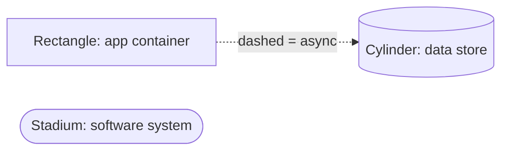
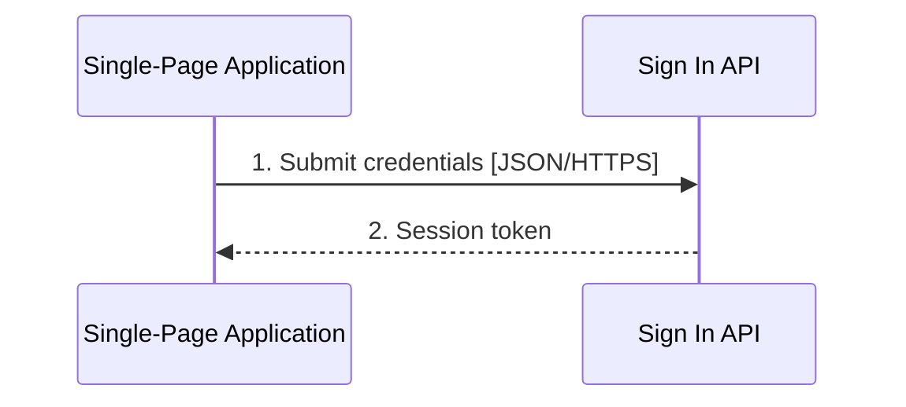
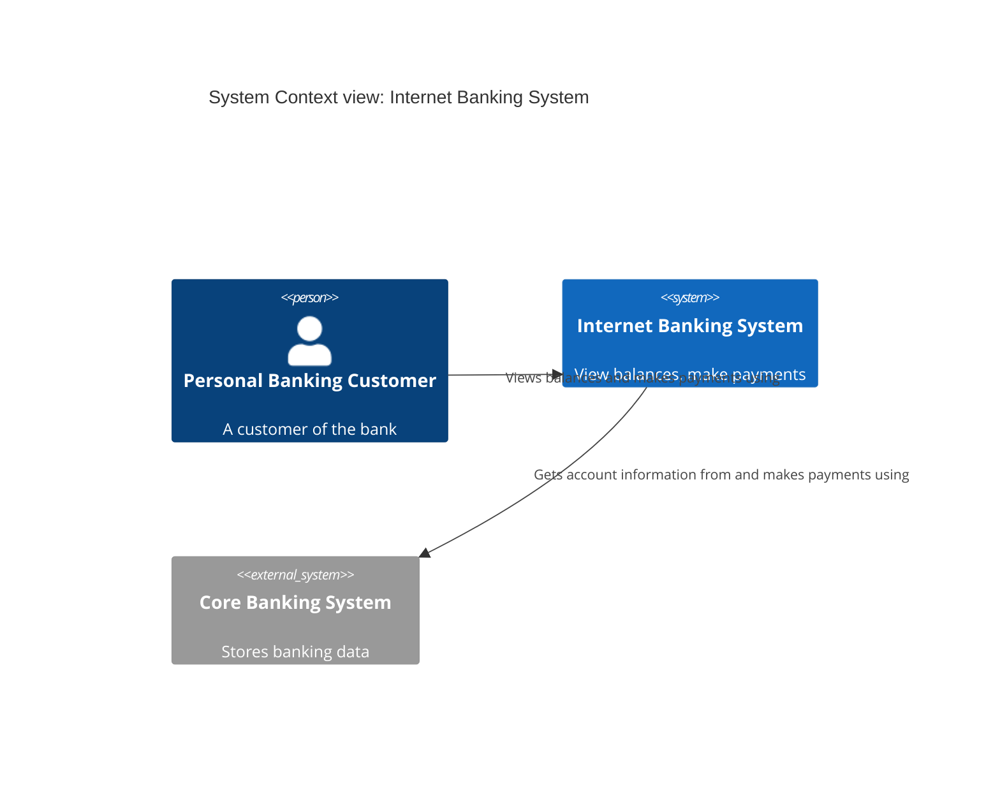

# Rendering C4, Deep Reference

How to render C4 diagrams depending on the toolchain. Default to **standard Mermaid**: it renders in GitHub, GitLab, most Markdown viewers, and IDEs with no plugins, diffs cleanly in version control, and forces you to write the element text that makes C4 diagrams good.

## Option 1: standard Mermaid (default)

### Static structure: `flowchart`

Shape conventions (declare them in a key note on the diagram or in accompanying text):

| Element | Mermaid shape | Example |
|---------|---------------|---------|
| Person | `["..."]` rectangle (or `("...")` stadium) | `Cust["Personal Banking Customer<br/>[Person]<br/>A customer of the bank"]` |
| Software system | `(["..."])` stadium/rounded | `CBS(["Core Banking System<br/>[Software System]<br/>Stores banking data"])` |
| Container (app) | `["..."]` rectangle | `BE["Backend<br/>[Container: Java and Spring Boot]<br/>JSON/HTTP API"]` |
| Container (data store) | `[(...)]` cylinder | `DB[("Database<br/>[Container: MySQL schema]<br/>Stores credentials")]` |
| Component | `["..."]` rectangle | `SEC["Security Component<br/>[Component: Spring bean]<br/>Validates tokens"]` |
| System/container boundary | `subgraph` | `subgraph IBS["Internet Banking System [Software System]"]` |
| Group (microservice, layer, org) | nested `subgraph` | `subgraph MSA["Microservice A [group]"]` |
| Deployment node | nested `subgraph` | `subgraph JVM["JVM [Deployment node]"]` |
| Infrastructure node | `["..."]` rectangle | `ALB["Load Balancer [Infrastructure node]"]` |

Relationship conventions:

- Unidirectional arrows only: `A -->|"Intent label [protocol]"| B`.
- Sync vs async: solid `-->` vs dashed `-.->`, declared in the key.
- `<br/>` for line breaks inside boxes; always include the `[Type: Technology]` line and a one-line description.
- Boundary subgraphs can be styled dashed: `style IBS stroke-dasharray: 5 5`.

Key/legend on-diagram (unobtrusive):



### Dynamic: `sequenceDiagram`



Number every message. Solid `->>` for requests, dotted `-->>` for returns. Collaboration-style dynamics are just a `flowchart` with numbered labels.

### Code: `classDiagram`

Standard UML class notation; prune members to what the story needs.

### Limits

Standard Mermaid has no C4 semantics: it will happily let you put a component on a context diagram. The discipline is yours (or the reviewer's). Layout control is limited; accept the auto-layout or reorder declarations to nudge it.

## Option 2: Mermaid C4 diagrams (`C4Context`, `C4Container`, ...)

Mermaid ships experimental C4 support with dedicated element macros:



Types: `C4Context`, `C4Container`, `C4Component`, `C4Deployment`, `C4Dynamic`. Macros: `Person`, `System`, `System_Ext`, `Container`, `ContainerDb`, `Container_Boundary`, `Component`, `Deployment_Node`, `Rel`, `BiRel`, `UpdateRelStyle`, `UpdateLayoutConfig`.

Caveats: marked experimental, rendering support varies by Mermaid version and host (GitHub's Mermaid may lag), and the notation is fixed to the blue/gray style. Use only when you control the render pipeline.

## Option 3: C4-PlantUML

PlantUML with the C4 stdlib (`!include <C4/C4_Context>` etc.): the most complete C4-specific notation, sprites, and layout hints. Requires PlantUML in the toolchain; good for docs sites that already render PlantUML.

## Option 4: Structurizr DSL (modeling, not diagramming)

A textual **model** with views projected from it: rename once, every view updates; workspace diffable in git; queries and alternative visualizations possible.

```text
workspace {
  model {
    cust = person "Personal Banking Customer"
    ibs = softwareSystem "Internet Banking System" {
      ui = container "Single-Page Application" "Delivers banking UI" "JavaScript, Angular"
      be = container "Backend" "JSON/HTTP API" "Java, Spring Boot"
      db = container "Database" "Stores credentials" "MySQL schema" {
        tags "Database"
      }
    }
    cust -> ui "Views balances and makes payments using"
    ui -> be "Makes API calls to" "JSON/HTTPS"
    be -> db "Reads from and writes to" "SQL/TCP"
  }
  views {
    systemContext ibs { include * }
    container ibs { include * }
  }
}
```

Choose this path when the diagram set must stay consistent at scale or when you want model queries ("all dependencies of X"), drift checks, or generated landscapes. See the tooling and maturity sections of `advanced.md`.

## Practical guidance

| Situation | Render with |
|-----------|-------------|
| Answer in chat / PR description / README | Standard Mermaid `flowchart`/`sequenceDiagram`/`classDiagram` |
| Docs site with Mermaid plugin pinned | Standard Mermaid; C4-mermaid only after verifying the version renders it |
| Org standardized on PlantUML | C4-PlantUML |
| Long-lived, multi-view, many-system documentation | Structurizr DSL or another modeling tool |
| Whiteboard / workshop | Marker; apply the same element-text template |

Whatever the renderer: title, `[Type: Technology]` + description in every box, unidirectional labeled arrows, and a key.
