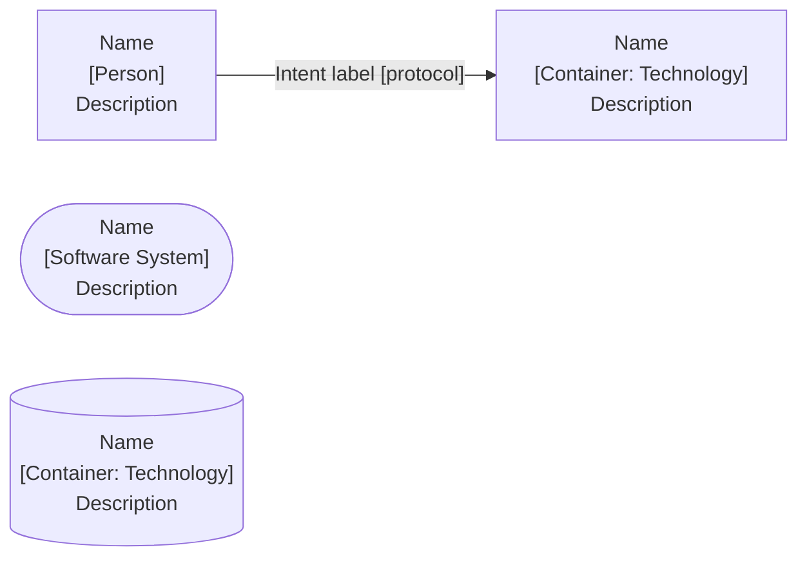
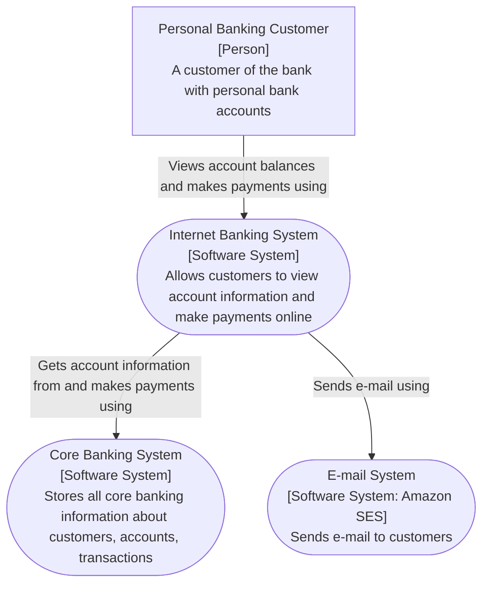
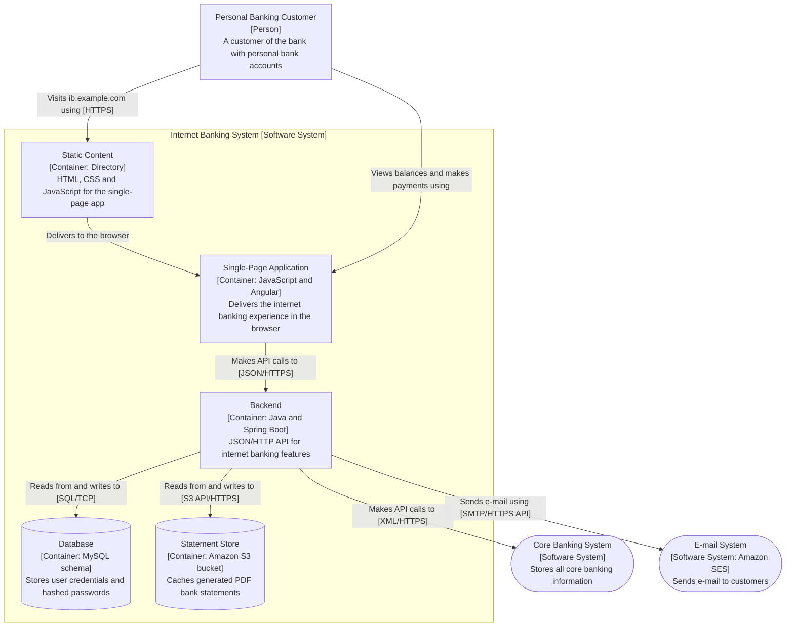
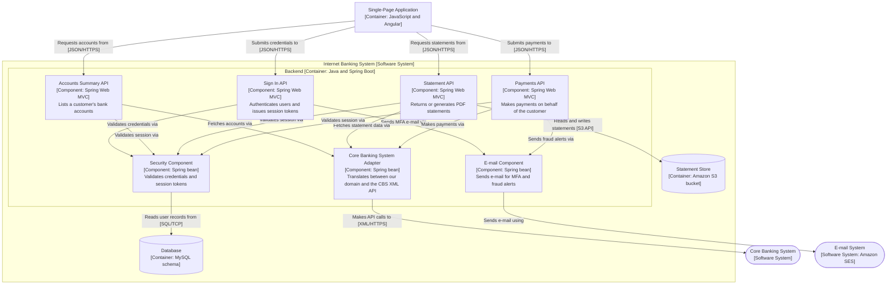
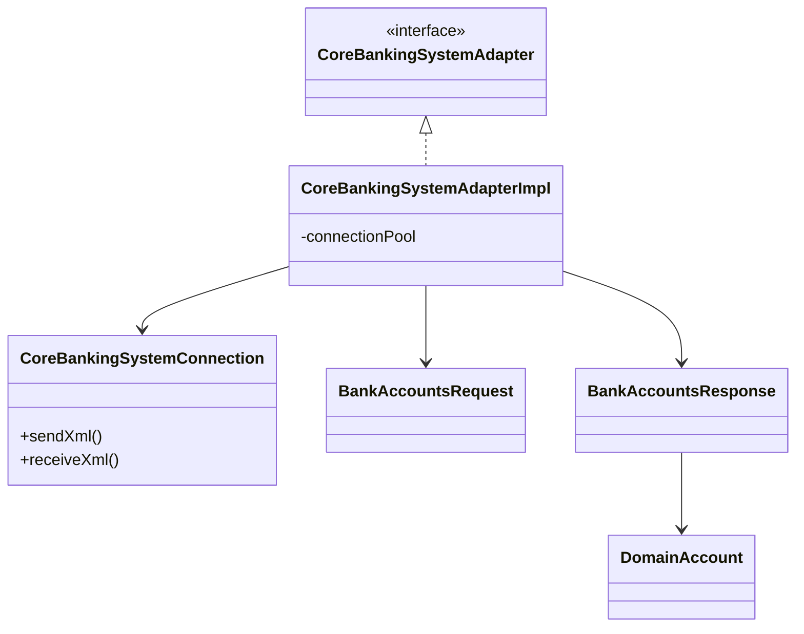
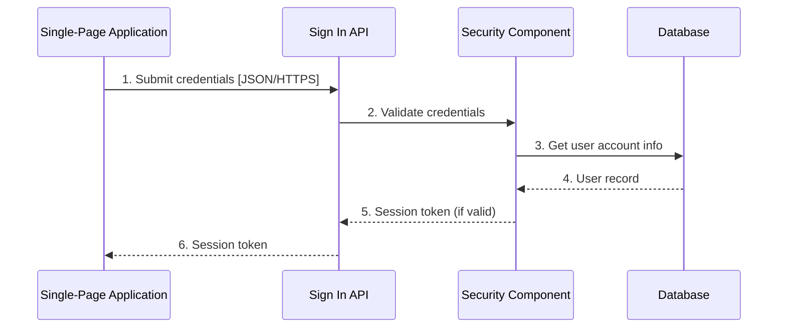
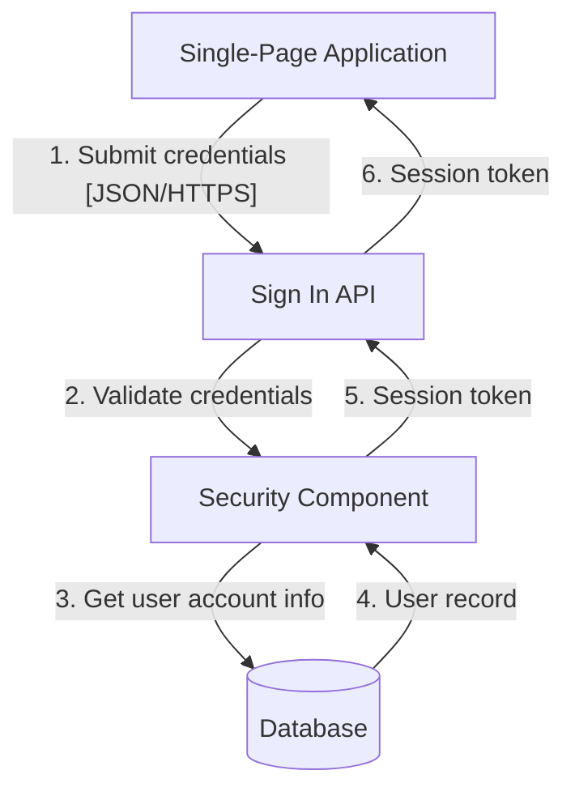
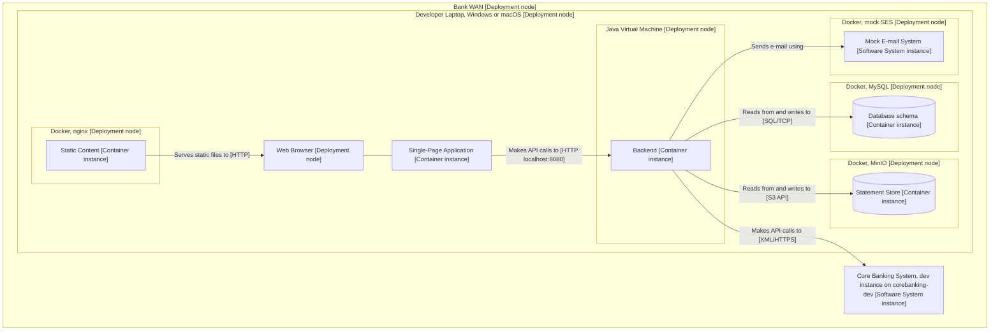
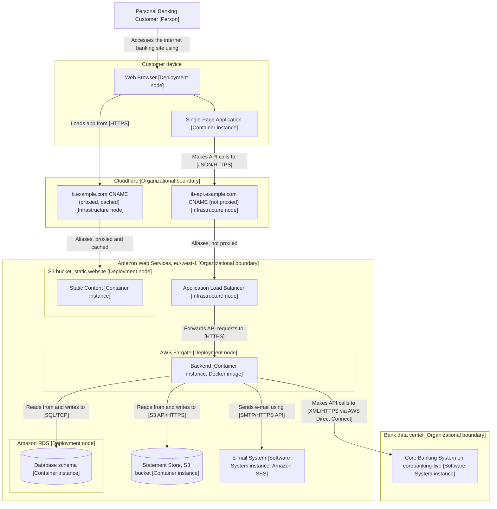
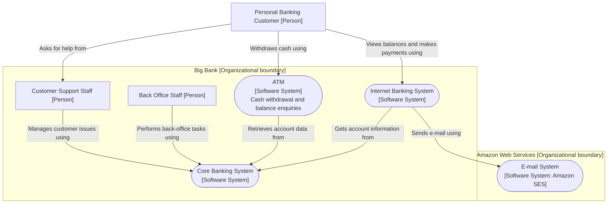

# C4 Worked Example: Internet Banking System (standard Mermaid)

A complete walkthrough of one fictional system at every zoom level, in standard Mermaid (no plugins). Scenario: a bank's engineering team builds an Internet Banking System on top of an existing off-the-shelf Core Banking System and Amazon SES. Reuse the shape conventions (rounded systems, square containers, cylinders for data stores, dashed subgraph boundaries) and change the content.

Shape/key convention used throughout:

## Level 1: System Context

Build it in steps: the system alone, then users, then each external dependency.

Title: `System Context view: Internet Banking System`. Note the absence of any technology or protocol: intent only.

## Level 2: Container

Zoom into the same system. Same people and external systems for continuity, plus the boundary box, plus technology and protocol everywhere. The story: SPA in the browser, static content served separately, a Java/Spring Boot backend (browser cannot securely reach the Core Banking System directly), a MySQL schema for credentials (the off-the-shelf CBS is too costly to change), and an S3 bucket caching PDF statements (the CBS is slow for old transactions).

Title: `Container view: Internet Banking System`.

Two modeling decisions worth copying:

- **SES is a software system; the S3 bucket is a container.** SES is an external API dependency we treat as opaque. The bucket's contents, layout, and formats are owned by this system, so it is an integral data store despite being hosted by AWS.
- **"Static Content" is a directory, not "nginx".** The serving mechanism varies per environment (nginx in dev, S3+Cloudflare in prod), so it belongs on the deployment diagrams, not here.

## Level 3: Component (backend only)

One container per diagram. Story order: sign-in first, then accounts, then statements, then payments.

Title: `Component view: Internet Banking System, Backend`. In-process component-to-component arrows carry intent only (no protocol). This diagram is already near the clutter limit; beyond this, split by feature slice (see `advanced.md`).

## Level 4: Code (one component)

Zoom into the Core Banking System Adapter. Pattern being taught: every CBS call is a request/response class pair behind a pooled connection.

Title: `Code view: Core Banking System Adapter component`. Hand-drawn and deliberately sparse; the IDE can generate the full version on demand.

## Dynamic: sign-in flow (both styles)

Sequence style:

Collaboration style (same information, free-form layout, numbered arrows):

Title either way: `Dynamic view: sign-in feature (component level)`.

## Deployment: development environment

Everything on the developer laptop inside the bank WAN. Local substitutes for cloud services: nginx via Docker for static content, MySQL via Docker, MinIO as the S3-compatible statement store, a mock SES that logs instead of sending. The Core Banking System is an opaque shared dev instance in the data center.

Title: `Deployment view: Internet Banking System, development`. Plain HTTP locally; no TLS certificate hassle.

## Deployment: live environment

Title: `Deployment view: Internet Banking System, live`. Note HTTPS everywhere now, org-boundary boxes, and deliberate omissions for brevity (availability zones, subnets, the Docker registry).

## System Landscape

Context diagram without a single-system focus, widened to the bank:

Title: `System Landscape view: Big Bank (partial)`. The customer-to-support-staff relationship is included because it explains *why* support staff use the Core Banking System.
